# MCP Travel Assistant Architecture

## What is MCP (Model Context Protocol)?

**Model Context Protocol (MCP)** is an open protocol developed by Anthropic that enables AI assistants to securely access external tools, data sources, and services. Think of it as a standardized way for AI models to "plug into" real-world capabilities beyond their training data.

### Key Concepts

- **MCP Servers**: Specialized services that expose tools, resources, and prompts
- **MCP Clients**: Applications that connect to MCP servers to use their capabilities
- **Tools**: Functions that the AI can call to perform actions (e.g., search flights, get weather)
- **Resources**: Data sources that can be read by the AI (e.g., saved searches, cached results)
- **Prompts**: Pre-built prompt templates for common tasks

### Why MCP Matters

Traditional AI assistants are limited to their training data, which can be outdated or incomplete. MCP bridges this gap by:

1. **Real-time Data Access**: Get live information from APIs and services
2. **Modular Architecture**: Each capability is a separate, reusable server
3. **Standardized Interface**: One protocol works across different tools and providers
4. **Secure & Controlled**: Servers run independently with their own permissions

---

## Concieragent MCP Architecture

This project demonstrates MCP's power by orchestrating **6 specialized MCP servers** through a single AI travel assistant.

### System Overview

```mermaid
graph TB
    subgraph "User Layer"
        User[👤 User]
        Hologram[📱 Hologram Mobile App<br/>E2E Encrypted]
    end

    subgraph "Protocol Layer"
        VS_Agent[🐳 VS Agent<br/>DIDComm Protocol Handler]
    end

    subgraph "Application Layer"
        Bot[🤖 Concieragent Bot Server<br/>Node.js + TypeScript]
        TravelAgent[🧠 TravelAgent<br/>Orchestration Logic]
        McpClient[🔌 McpClient<br/>MCP Protocol Client]
    end

    subgraph "AI Layer"
        LLM{Multi-LLM Provider}
        OpenAI[OpenAI GPT-4o]
        Claude[Claude Sonnet]
        Ollama[Ollama Local]
    end

    subgraph "MCP Servers Layer"
        FlightServer[✈️ Flight Server<br/>SerpAPI]
        HotelServer[🏨 Hotel Server<br/>SerpAPI]
        EventServer[🎭 Event Server<br/>SerpAPI]
        WeatherServer[🌤️ Weather Server<br/>OpenWeatherMap]
        GeocoderServer[📍 Geocoder Server<br/>Nominatim]
        FinanceServer[💰 Finance Server<br/>SerpAPI]
    end

    subgraph "External APIs"
        SerpAPI[SerpAPI<br/>Flights, Hotels, Events, Finance]
        OpenWeather[OpenWeatherMap<br/>Weather Data]
        Nominatim[Nominatim<br/>Geocoding]
    end

    User -->|DIDComm| Hologram
    Hologram -->|Encrypted Messages| VS_Agent
    VS_Agent -->|HTTP Webhooks| Bot
    Bot --> TravelAgent
    TravelAgent --> LLM
    LLM --> OpenAI
    LLM --> Claude
    LLM --> Ollama
    TravelAgent --> McpClient
    McpClient -->|MCP Protocol| FlightServer
    McpClient -->|MCP Protocol| HotelServer
    McpClient -->|MCP Protocol| EventServer
    McpClient -->|MCP Protocol| WeatherServer
    McpClient -->|MCP Protocol| GeocoderServer
    McpClient -->|MCP Protocol| FinanceServer
    
    FlightServer --> SerpAPI
    HotelServer --> SerpAPI
    EventServer --> SerpAPI
    FinanceServer --> SerpAPI
    WeatherServer --> OpenWeather
    GeocoderServer --> Nominatim

    style User fill:#e1f5ff
    style Hologram fill:#e1f5ff
    style VS_Agent fill:#fff4e1
    style Bot fill:#e8f5e9
    style TravelAgent fill:#e8f5e9
    style McpClient fill:#e8f5e9
    style LLM fill:#f3e5f5
    style FlightServer fill:#fff9c4
    style HotelServer fill:#fff9c4
    style EventServer fill:#fff9c4
    style WeatherServer fill:#fff9c4
    style GeocoderServer fill:#fff9c4
    style FinanceServer fill:#fff9c4
```



### Request Flow

```mermaid
sequenceDiagram
    participant User
    participant Hologram
    participant VS_Agent
    participant Bot
    participant TravelAgent
    participant LLM
    participant McpClient
    participant MCP_Server
    participant External_API

    User->>Hologram: "What's the weather in Tokyo?"
    Hologram->>VS_Agent: Encrypted DIDComm message
    VS_Agent->>Bot: HTTP POST /message-received
    Bot->>TravelAgent: Process message
    
    TravelAgent->>TravelAgent: Detect language (EN/ES/FR)
    TravelAgent->>TravelAgent: Build context from history
    
    TravelAgent->>LLM: User query + context + available tools
    LLM->>LLM: Analyze request
    LLM->>TravelAgent: Tool call: get_current_conditions("Tokyo")
    
    TravelAgent->>McpClient: Call MCP tool
    McpClient->>MCP_Server: MCP protocol request
    MCP_Server->>External_API: API call (OpenWeatherMap)
    External_API->>MCP_Server: Weather data
    MCP_Server->>McpClient: MCP response
    McpClient->>TravelAgent: Tool result
    
    TravelAgent->>LLM: Tool result + context
    LLM->>LLM: Format response in user's language
    LLM->>TravelAgent: Formatted response
    
    TravelAgent->>Bot: Response message
    Bot->>VS_Agent: HTTP response
    VS_Agent->>Hologram: Encrypted message
    Hologram->>User: "Current weather in Tokyo: 22°C, Sunny..."
```



### MCP Server Details

```mermaid
graph LR
    subgraph "MCP Server Architecture"
        Server[MCP Server<br/>Python + FastMCP]
        
        subgraph "Components"
            Tools[🔧 Tools<br/>Callable Functions]
            Resources[📚 Resources<br/>Data Sources]
            Prompts[💬 Prompts<br/>Templates]
        end
        
        subgraph "Capabilities"
            API[External API<br/>Integration]
            Cache[Local Cache<br/>JSON Files]
            Validation[Input Validation<br/>& Error Handling]
        end
    end
    
    Server --> Tools
    Server --> Resources
    Server --> Prompts
    Tools --> API
    Tools --> Cache
    Resources --> Cache
    API --> Validation
```



---

## The 6 MCP Servers

### 1. ✈️ Flight Server (`flight_server`)

**Purpose**: Search and filter flights using SerpAPI's Google Flights integration.

**Tools**:
- `search_flights` - Search flights by origin, destination, dates
- `get_flight_details` - Get detailed flight information
- `filter_flights_by_price` - Filter by maximum price
- `filter_flights_by_airline` - Filter by airline preference

**Resources**:
- `flights://searches` - List all saved searches
- `flights://{search_id}` - Get specific search details

**External API**: SerpAPI Google Flights

---

### 2. 🏨 Hotel Server (`hotel_server`)

**Purpose**: Find hotels and vacation rentals with advanced filtering.

**Tools**:
- `search_hotels` - Search hotels by location, dates, guests
- `get_hotel_details` - Get detailed hotel information
- `get_property_details` - Extended property information
- `filter_hotels_by_price` - Filter by price range
- `filter_hotels_by_rating` - Filter by star rating
- `filter_hotels_by_amenities` - Filter by amenities (pool, wifi, etc.)
- `filter_hotels_by_class` - Filter by hotel class

**Resources**:
- `hotels://searches` - List all saved searches
- `hotels://{search_id}` - Get specific search details

**External API**: SerpAPI Google Hotels

---

### 3. 🎭 Event Server (`event_server`)

**Purpose**: Discover local events, concerts, sports, and cultural activities.

**Tools**:
- `search_events` - Search events by location, date, query
- `get_event_details` - Get detailed event information
- `filter_events_by_date` - Filter by date range
- `filter_events_by_type` - Filter by event type
- `filter_events_by_venue` - Filter by venue

**Resources**:
- `events://searches` - List all saved searches
- `events://{search_id}` - Get specific search details

**External API**: SerpAPI Google Events

---

### 4. 🌤️ Weather Server (`weather_server`)

**Purpose**: Get current weather conditions and forecasts.

**Tools**:
- `get_current_conditions` - Current weather for a location
- `get_weather_forecast` - 5-day weather forecast
- `get_weather_data_details` - Extended weather data

**Resources**:
- `weather://forecasts` - List cached forecasts
- `weather://{location}` - Get specific location data

**External API**: OpenWeatherMap API

---

### 5. 📍 Geocoder Server (`geocoder_server`)

**Purpose**: Convert addresses to coordinates and calculate distances.

**Tools**:
- `geocode_location` - Address to coordinates
- `reverse_geocode` - Coordinates to address
- `batch_geocode` - Multiple locations at once
- `calculate_distance` - Distance between two points
- `search_locations` - Search for places

**Resources**:
- `geocoder://locations` - List cached locations
- `geocoder://{location}` - Get specific location data

**External API**: Nominatim (OpenStreetMap)

---

### 6. 💰 Finance Server (`finance_server`)

**Purpose**: Currency conversion and stock market data.

**Tools**:
- `convert_currency` - Real-time currency conversion
- `lookup_stock` - Stock price lookup
- `get_market_overview` - Market summary
- `get_finance_details` - Extended finance data
- `filter_stocks_by_price_movement` - Filter stocks
- `get_historical_data` - Historical prices

**Resources**:
- `finance://conversions` - List cached conversions
- `finance://{symbol}` - Get specific stock data

**External API**: SerpAPI Finance

---

## How MCP Works in This Project

### 1. Server Initialization

When the bot starts, `McpClient` spawns each MCP server as a separate Python process:

```typescript
// Each server runs independently
const flightClient = new McpClient(
  path.join(__dirname, '../mcp_travelassistant/servers/flight_server/flight_server.py'),
  { SERPAPI_KEY: process.env.SERPAPI_KEY }
);
```

### 2. Tool Discovery

The bot queries each server to discover available tools:

```typescript
const tools = await mcpClient.listTools();
// Returns: [{ name: "search_flights", description: "...", parameters: {...} }]
```

### 3. Tool Execution

When the LLM decides to use a tool, the request flows through:

1. **LLM** → Analyzes user request, decides which tool to call
2. **TravelAgent** → Receives tool call request from LLM
3. **McpClient** → Formats request according to MCP protocol
4. **MCP Server** → Executes tool, calls external API
5. **Response** → Flows back through the chain to the user

### 4. Context Management

The bot maintains conversation context and uses it to:
- Avoid repetitive questions
- Remember user preferences
- Build on previous searches
- Provide coherent multi-turn conversations

---

## Benefits of MCP Architecture

### ✅ Modularity
Each server is independent and can be:
- Updated without affecting others
- Reused in other projects
- Tested in isolation
- Scaled independently

### ✅ Real-time Data
Unlike static training data, MCP tools provide:
- Live flight prices
- Current weather conditions
- Real-time currency rates
- Up-to-date event listings

### ✅ Standardized Interface
All servers follow the same MCP protocol:
- Consistent tool calling interface
- Uniform error handling
- Standardized resource access
- Common prompt templates

### ✅ Security
Each server runs with:
- Its own environment variables
- Isolated API keys
- Independent error boundaries
- Separate process isolation

---

## Technology Stack

| Component | Technology | Purpose |
|-----------|-----------|---------|
| **Protocol** | MCP (Model Context Protocol) | Standardized tool interface |
| **Servers** | Python 3.12 + FastMCP | MCP server implementation |
| **Client** | TypeScript + MCP SDK | MCP client implementation |
| **Orchestration** | Node.js + TypeScript | Bot logic and coordination |
| **AI** | OpenAI / Claude / Ollama | LLM providers |
| **APIs** | SerpAPI, OpenWeatherMap, Nominatim | External data sources |

---

## Example: Complete Request Flow

**User**: "I want to fly from New York to Tokyo next week and stay at a 5-star hotel"

**Flow**:
1. **Language Detection**: English detected
2. **Context Building**: Extract dates, locations, preferences
3. **LLM Analysis**: Identifies need for multiple tools
4. **Tool Calls**:
   - `geocode_location("New York")` → Get coordinates
   - `geocode_location("Tokyo")` → Get coordinates
   - `search_flights("JFK", "NRT", "2025-12-20", ...)` → Find flights
   - `search_hotels("Tokyo", "2025-12-20", "2025-12-27", filter_by_class=5)` → Find hotels
5. **Response Formatting**: LLM formats results in natural language
6. **User Response**: "I found 3 flights from JFK to Tokyo starting at $892. Here are 5-star hotels in Tokyo..."

---

## Conclusion

This project demonstrates how **MCP enables AI assistants to go beyond their training data** by connecting to real-world services. The modular architecture makes it easy to:

- Add new capabilities (just create a new MCP server)
- Switch LLM providers (OpenAI, Claude, or Ollama)
- Scale individual components
- Maintain and update services independently

**MCP is the bridge between AI intelligence and real-world action.**
